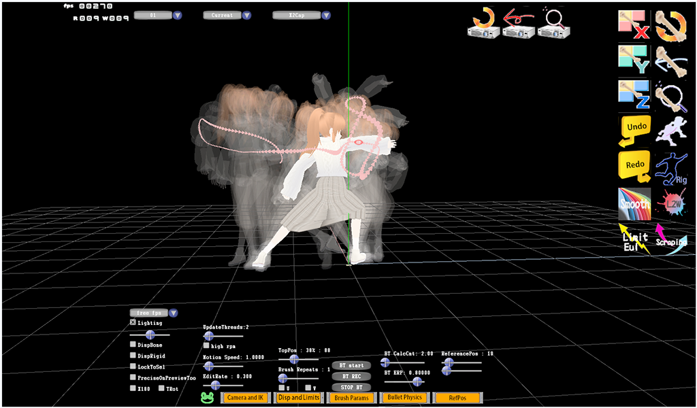
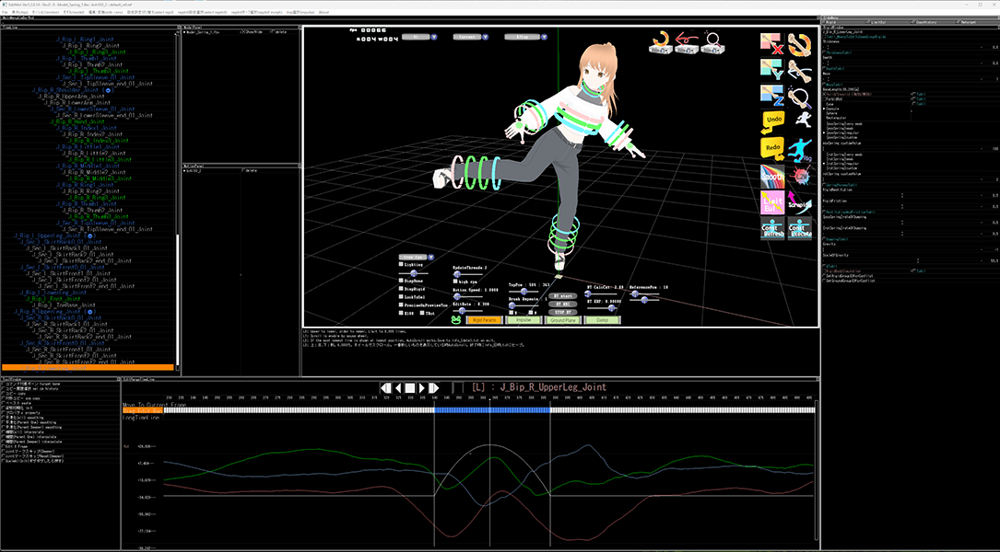
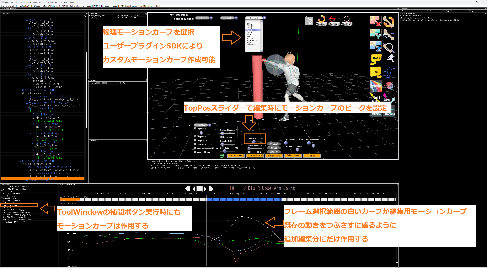
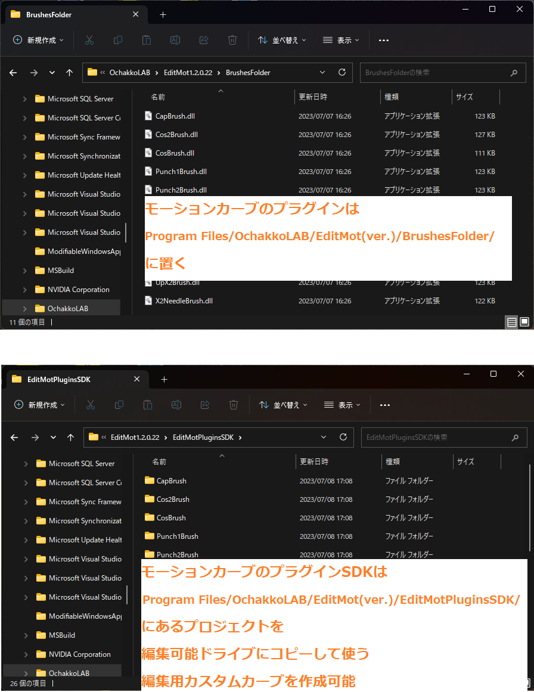

# EditMot (OSS Name : MameBake3D)
モーキャプ変換物理編集リターゲットツール  
モーションキャプチャをブラシで盛るように編集 fbxにしてUnityへ(bvh, fbx, Unity, Maya, VRoid対応)  
FBX Animation Tool.(Load Baked FBX File. Edit Animation. Setting bullet params. Output to FBX file.) 

# Usage
ゲーム用モーション作成  
何も無いところから作るのは難しい  
モーキャプの動きを大げさにするだけなら簡単！  
元のモーションを潰さずに盛るように編集する方法で  モーションキャプチャがゲーム用モーションになる  
FBXファイルにしてUnityへ  
全てのフレームにキーがあるモーションキャプチャの編集には専用ソフトが必要  
EditMotはそのためのソフトです  

# ReadMe
[ReadMe/readme.txt](ReadMe/readme.txt)

# UpdateLog
[ReadMe/UpdateLog.txt](ReadMe/UpdateLog.txt)

# Images
  
Fig.1 Edit using RefPos.  

Fig.2 CustomRig ON.  

Fig.3 Using Custom Weight Curve For PhysicalMotion.  

コンボボックスでモーションカーブを選択  
TopPosスライダーでモーションカーブの重みのピーク位置を設定  
オイラーグラフのフレーム選択範囲の白いカーブが編集用モーションカーブ  
ジョイントをマウスでドラッグすると  
既存の動きを潰さずに盛るように 追加編集分にだけモーションカーブが作用  
モーションカーブはプラグインSDKによりカスタマイズ可能  

Fig.4 PluginSDK of Custom Weight Curve.

# Description
[Desctiption at OchakoLAB](https://ochakkolab.jp/LABMenu/MameBake3D.html "Desc-1")

# Channel
[Youtube Channel](https://www.youtube.com/@ochakkolab "Channel")

# Site
[OchakkoLAB](https://ochakkolab.jp/ "OchakkoLAB")

